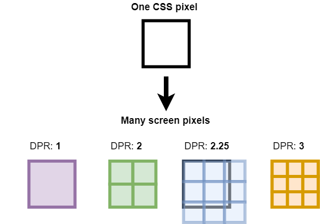

# Interactive-Web

_Fastcampus 인터랙티브 웹 개발 강의 내용을 정리해둔 자료입니다._

# basic

## 404 page

### cubic bezier [참고](https://cubic-bezier.com/)


> cubic-bezier(P1.x, P1.y, P3.x, P3.y);

- P0과 P2가 고정이고 P1과 P3의 x, y좌표만 잡아주면 됨

```css
animation-timing-function: cubic-bezier(0.35, 0.28, 0.82, 0.87);
```

## firewatch [참고](https://www.firewatchgame.com/)

### parallax Scrolling

- 레이어별 스크롤 속도를 다르게 하여 입체감을 주는 디자인 기법
- 모바일에서는 권장하지 않는 기법 중 하나임
  - `성능` : 저성능 기기에서는 느린 스크롤 등 성능 저하를 야기할 수 있음
  - `입력 방식 차이` : PC의 경우 마우스 또는 트랙패드로 스크롤을 하지만, 모바일은 주로 터치스크린이라 스크롤 속도와 방향 조절을 어렵게 만들 수 있음
  - `화면 방향 전환이 가능` : 모바일 장치는 보통 화면 방향이 자유 자재로 변환한다. 즉, 화면 사이즈, 스크롤 높이 등이 쉽게 바뀔 수 있어 의도대로 동작하지 않을 수 있음
  - `유저 경험` : 위의 사유들이 궁극적으로 유저 경험을 해칠 수 있음

| js                                                                 | css                                         |
| ------------------------------------------------------------------ | ------------------------------------------- |
| 움직임 등에 대해 보다 직접적인 통제가 가능. 즉, 구현 자유도가 높음 | 가볍고 효율적                               |
| 사용자 인풋에 따르는 등 복잡한 인터랙션, 애니메이션도 구현 가능    | 직접 조작 가능한 인터랙티브 요소가 제한적   |
| 하고자 하는 인터랙션 요소에 따라 웹 성능에 지장을 줄 수 있음       | `비교적 간단한 인터랙티브 요소 적용에 적합` |
| `유저 인풋 등과 관계된 인터랙티브가 필요한 경우에 적합`            |

### CSS property

#### CSS perspective

- 해당 요소의 z = 0 평면과 사용자 사이의 거리를 정의
- transform 효과를 주고자 하는 부모 요소에 적용
- 값이 클수록(거리가 멀수록) 변형 효과가 적음
- 값이 작을수록(거리가 가까울수록) 변형 효과가 큼

### layer transform

- 스크롤의 속도와 비슷하면 덜 움직이는 것처럼 보임

### viewport width

```js
const viewportWidth = document.documentElement.clientWidth;
```

- document.documentElement : 웹 페이지의 root 요소(보통 \<html\>)

- document.documentElement.clientWidth : 웹 페이지 root 요소의 너비, 즉 HTML 문서의 너비(border, margin, scrollbar 너비 제외)

## kakao

### scroll-snap-type

- 특정 포인트에 스크롤을 멈추게 할 때 사용
- `none` : 무시
- `x mandatory` : 수평 방향으로
- `y proximity` : 수직 방향으로

### scroll-snap-align

- 박스의 snap의 기준이 될 위치
- `start`
- `end`
- `center`

## next-level-fairs

### IntersectionObserver

- 요소가 유저의 뷰포트에 들어왔는지, 숨겨졌는지 탐지
- 지연 로딩 이미지, 애니메이션 발동, 유저의 활동 추적 등에 용이

# canvas

## canvas 기초

### canvas size 조절 방식

1. css를 수정해서 canvas size 조절
1. canvas tag의 width와 height 속성(canvas의 고유 크기라고 생각하면 됨)

```js
canvas.style.width = "300px";
canvas.style.height = "300px";

canvas.width = 100;
canvas.height = 100;

ctx.fillRect(10, 10, 50, 50);
```

canvas 고유의 크기가 100x100인데 css를 통해 3배 확대가 되었기 때문에 pixel이 깨지게 됨

### window.devicePixelRatio

<br />

- DPR이 높을수록 더 선명한 그래픽을 보여주게 됨.
- DPR=2라면, 1개의 CSS 픽셀을 4개의 물리적 픽셀이 표현하니 훨씬 선명하게 보이는 것이다.
- 1px을 4개의 물리적 픽셀로 표현 할 수 있으니 0.5px 선 같은 것도 표현할 수 있다.
- dpr로 인해 canvas의 width와 height이 변화가 일어나게 됨(이를 scale로 맞춰줌)

## 파티클

### requestAnimationFrame

- 현재 모니터의 주사율에 맞춰서 프레임이 나온다.
- 이 말은 프레임당 x를 1px 이동시킨다면, 144Hz 모니터는 144픽셀을 이동하게 되고 60Hz 모니터는 60픽셀을 이동하게 됨

### GOOEY Effect

- blur와 contrast를 이용해서 구현

### svg filter [참고](https://yoksel.github.io/svg-filters/#/)

### dat.gui

- 위의 svg filter의 불편한 점을 개선

## 폭죽

### Performance Monitor

- 개발자도구 -> ... -> more tools

### HSL(Hue Saturation Lightness)

- Hue(색상) : 0~360도, 0도는 빨강
- Saturation(채도) : 색상의 진한 정도 0(무채색) ~ 100%
- Lightness(명도) : 색상의 밝은 정도 0%(검정) ~ 100%(흰색)

## 팡파레(Confetti)

- npm -> `canvas-confetti`

## minigame

- [game assets 다운 가능 사이트](https://itch.io/)
- Browse Games -> Assets
- `tiled` : [이동](https://www.mapeditor.org/)
- bevouliin [참고](https://bevouliin.com) - 라이센스 주의

- 충돌 체크

```js
isColliding(target) {
  return (
    target.x + target.width >= this.x &&
    target.x <= this.x + this.width &&
    target.y + target.height >= this.y &&
    target.y <= this.y + this.height
  );
}
```

## rope_physics

- blur 효과를 주고 싶을 땐 작은 사이즈의 이미지를 캔버스로 불러와 확대시키면 된다.

## matter.js ([참고](https://brm.io/matter-js/))

### Engine

- 물리 시뮬레이션 담당
- Body들의 List들을 관리
- Body들의 위치, 속도, 충돌 등을 계산
- gravity, enableSleeping, positionIterations,...

### Render

- Body들의 시각적인 부분을 담당
- Canvas의 Width, Height, color, ...
- pixelRatio, showVelocity, show로 시작하는 디버깅 도움툴

### Runner

- Engine, Render의 업데이트 Loop 관리
- beforeTick, tick, afterTick
- fps, requestAnimationFrame

### Body

- 단일 물리적 객체(시각적으로 표시 안됨)
- 한 객체의 position, velocity, force, mass, ...
- Rope 프로젝트의 Dot 같은 느낌

### Bodies

- 물리값만 가진 Body를 시각적으로 쉽게 표현하기 위한 모듈
- 원, 사각형, 다각형, SVG Paths 등 쉽게 제작 가능

### Composite

- Composite.add(engine.world, [...body])
- World에 Body를 추가해주는 역할
- 또는 Body들을 하나로 묶는 그룹의 역할도 가능

### Mouse

- Canvas 내에서의 포지션 값을 위함
- 하지만 이 하나로는 Canvas의 Body들과 상호작용은 할 수 없음

### MouseConstraint

- 각 Body들과 상호작용을 할 수 있게 해줌(박스 들기 등)
- Mouse를 이 MouseConstraint와 연결하여 사용함

### Events

- 말 그대로 Events를 등록

### Bodies.Rectangle options

- chamfer : 다른 객체와의 충돌을 조금 더 완만하게(border-radius 느낌)

### IntersectionObserver

- ( (entries, observer) => {}, options);
- options
  - root : observe 대상 가시성 여부를 위한 viewport. (기본값 : 기기의 viewport)
  - rootMargin : viewport의 가시성 검증을 위한 영역을 확대/축소 (css margin 느낌)
  - threshold : 관측 대상의 몇 %가 보였을 때 intersecting 처리를 할 지 결정 (0 ~ 1)
